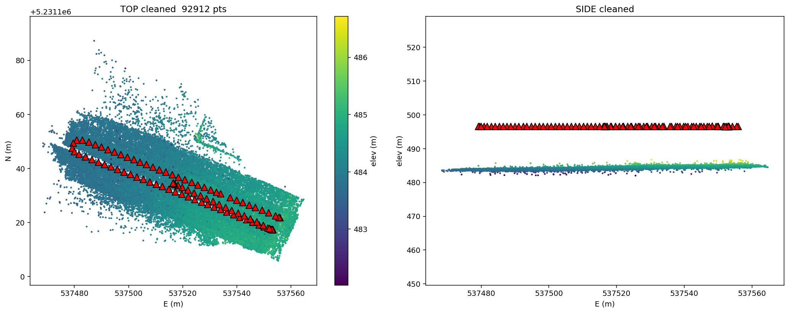
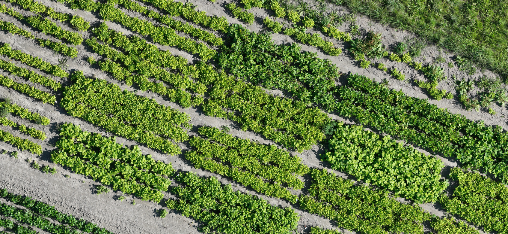
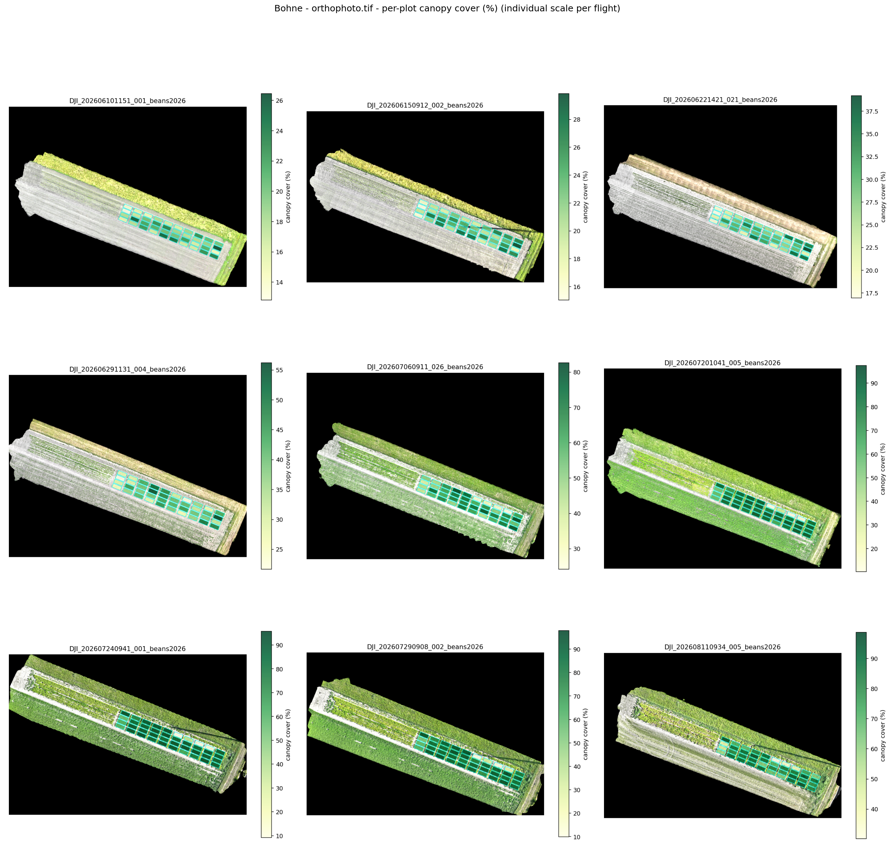

# agri-drone-pipeline

UAV photogrammetry and crop-analysis pipeline for agricultural field trials.
Takes raw DJI Mavic (RTK) survey imagery — currently the only supported
drone/data source — and turns repeated flights over the same field into
orthomosaics, DSMs/DTMs/CHMs, and per-plot **canopy height**, **canopy
cover**, and **excess-green (ExG) / vegetation index** time series across the
season, for plant-breeding selection decisions. Runs on Google Colab (GPU)
or any Python machine with CUDA.

```
agri-drone-pipeline/
├── reconstruction/
│   └── odm_light_cuda_v11.py     SfM + dense reconstruction, CUDA
├── orthomosaic/
│   ├── compositor_v5_2.py         true-orthophoto compositor
│   └── batch.py                   run_ortho() over every flight
├── batch/
│   └── run_pipeline_batch.py      run_pipeline() over every NEW flight
├── analysis/
│   └── plot_analyzer/             per-plot canopy stats, v1
├── common/                        shared path/Drive helpers
└── docs/images/                   example outputs (this README)
```

## Pipeline at a glance

```
DJI JPGs (RTK GPS + XMP DewarpData)
        │
        ▼
┌───────────────────────────┐
│ batch/run_pipeline_batch.py│  walks <DJI_ROOT>/<Crop>/<flight>/,
│  → reconstruction/          │  skips flights already complete,
│    odm_light_cuda_v11.py    │  runs run_pipeline() on the rest
└────────────┬────────────────┘  → ortho_inputs.npz, fused.ply, dsm/dtm/chm.tif
             │
             ▼
┌───────────────────────────┐
│ orthomosaic/batch.py        │  run_ortho_batch()
│  → compositor_v5_2.py       │  winner-take-all best-view texturing
└────────────┬────────────────┘  → orthophoto.tif (true ortho, EPSG:32632)
             │
             ▼
┌───────────────────────────┐
│ analysis/plot_analyzer/     │  reference_ground → extract → qc → viz
└────────────┬────────────────┘  → per-plot canopy height / cover / indices
             ▼
   plot_analysis_summary/*.csv, growth_*.png, heatmaps
```

Everything is driven by two batch entry points — `batch/run_pipeline_batch.py`
for reconstruction and `orthomosaic/batch.py` for the ortho step — both of
which just walk the flight tree and process whatever is new. There's no
separate "repair the archive" step: if a flight needs redoing, pass
`force=True` for it.

## 1. Reconstruction — `reconstruction/odm_light_cuda_v11.py`

Turns a folder of DJI JPGs into a georeferenced sparse + dense reconstruction.

- **Feature matching**: SuperPoint (tiled + CLAHE) on images de-rotated to a
  common heading, matched with LightGlue — lets cross-strip pairs (>45° apart)
  match reliably.
- **RTK pose priors are actually used.** Earlier pipeline versions wrote RTK
  positions into COLMAP's `pose_priors` table but never told the mapper to use
  them (`use_prior_position` defaults to `False`); v11 sets it explicitly and
  writes `coordinate_system=CARTESIAN` with an anisotropic covariance (Z
  tighter than XY, since a doming bowl is spatially correlated across the
  block while RTK vertical noise is not).
- **Locked camera intrinsics is the fix that actually matters.** On
  near-planar survey blocks with little camera-height variation, letting
  bundle adjustment self-calibrate focal length lets it invent a *different*
  focal solution per flight while quietly encoding a radial bowl in the
  distortion terms — the same physical lens solved anywhere from 2620 to 4074
  px across different flights. Reading the factory calibration
  (`DewarpData`) out of each image's XMP and holding it fixed
  (`camera_model="DJI_DEWARP"`) removed the degeneracy outright: vertical
  residual (Z rms against RTK) dropped from 0.469 m to 0.011 m on the test
  flight — a 43× improvement, RTK priors held constant. 117 RTK priors simply
  can't outvote ~600k reprojection observations; they stabilize pose, locking
  intrinsics prevents the bowl from forming in the first place. This is the
  **default preset** in `batch/run_pipeline_batch.py` — new flights get it
  automatically.
- **Oblique frames stay in bundle adjustment, on purpose.** DJI's
  end-of-flight tilted pass is a deliberate anti-doming calibration maneuver
  and constrains the intrinsics nadir frames rely on — it's excluded again
  later, only at the *texturing* stage (see orthomosaic below).
- **Dense reconstruction** runs CUDA patch-match stereo + stereo fusion, with
  resumable per-stage checkpoints (`database.db` → `sfm_raw/` → `sfm/` →
  `fused.ply`) so a Colab disconnect never means starting over. Every
  checkpoint is stamped with `pipeline_version`; anything from an older
  pipeline version is invalidated automatically rather than silently reused.

Below: cleaned sparse point cloud and camera track for one flight (top-down
and side view) — this diagnostic is what first exposed the doming problem
that v11 was built to fix.



**Run it on new flights (recommended entry point):**
```python
from batch.run_pipeline_batch import run_pipeline_batch, preflight_dewarp

preflight_dewarp(DJI_ROOT)                 # check DewarpData is present, seconds
run_pipeline_batch(DJI_ROOT)               # locked-intrinsic preset, skips what's done
run_pipeline_batch(DJI_ROOT, crops=["Bohne"], require_depth_bundle=True)
```

**Or on a single flight directly:**
```python
from reconstruction.odm_light_cuda_v11 import run_pipeline, diagnose_doming

products = run_pipeline(
    flight_dir,
    camera_model="DJI_DEWARP", ba_refine_focal_length=False,
    ba_refine_principal_point=False, ba_refine_extra_params=False,
    use_prior_position=True, prior_std_xy=0.05, prior_std_z=0.035,
)
diagnose_doming(flight_dir)   # re-check the vertical residual any time, seconds
```

## 2. Orthomosaic — `orthomosaic/compositor_v5_2.py`

Builds a true orthophoto from the registered poses + dense/sparse cloud.

- **Winner-take-all, not blending.** Averaging pixels from multiple views
  produces semi-transparent "ghost" leaves wherever thin foliage sits above
  an imprecise DSM — each camera projects the same leaf to a slightly
  different pixel. Each output pixel instead takes the single most-nadir,
  depth-consistent view, with a narrow feather (`feather_lo=0.90`) applied
  only right at seams, so leaf interiors stay sharp.
- **Depth source priority**: `depth_bundle.npz` (persisted geometric depth
  maps) → live dense workspace → dense point cloud → sparse cloud — each a
  fallback for when the previous source isn't available in the current
  session.
- **Oblique frames are excluded from texturing** (kept in bundle adjustment
  upstream). Nadir angle is computed directly from the registered camera pose
  — no EXIF dependency — and frames beyond `max_nadir_deg` are dropped from
  both the texture loop and the DSM loop.
- **Bounds and resolution scale with the flight**, not fixed constants: IQR
  trimming + a camera-footprint clamp keeps a few stray reconstruction points
  from blowing up the canvas, and grid spacing defaults to a multiple of the
  flight's own native ground sample distance instead of a hardcoded value.



**Run it:**
```python
from orthomosaic.batch import run_ortho_batch

run_ortho_batch(DJI_ROOT, img_scale=1.0, dsm_smooth=0.10, max_nadir_deg=20.0)
```
or on one flight:
```python
from orthomosaic.compositor_v5_2 import run_ortho

tif = run_ortho(flight_dir / "pipeline_output" / "ortho_inputs.npz")
```

## 3. Field Plot Analyzer — `analysis/plot_analyzer/`

Turns the DSM/CHM and orthophoto rasters into per-plot canopy height, cover,
and vegetation-index time series, keyed to a trial design workbook
(plot_id → line_name).

- **Fixed reference ground surface, not per-plot percentile baselines.** A
  per-plot 5th-percentile-of-DSM baseline is biased once canopy closes: the
  5th-percentile pixel shifts from soil to the lowest leaves, and that shift
  correlates with the treatment effect being measured. `reference_ground.py`
  instead builds one ground surface from bare soil near (not far from) the
  plots — vegetation-rejected, cell-wise low-percentile seeded, robustly
  polynomial-fit with sigma-clipped residuals — and every later flight is
  aligned to it with only a single scalar datum offset (soil doesn't move
  more than a few cm in a season, so no plane/tilt correction is fit).
- **The pipeline's own `dtm.tif` is a cross-check, never the reference** — it
  disagreed with observed bare soil by more than a meter on test flights,
  because it's a morphological-opening interpolation, not observed ground.
- **Thin bare-ground samples get a fallback, not silence.** Late-season
  flights where canopy has closed over the sampling ring fall back to the
  last well-aligned flight's datum offset below a hard pixel-count floor,
  rather than producing a noisy or silently-wrong correction.
- **Coverage is gated on the plot polygon area**, not the padded sampling
  grid — a narrow trial strip can look under-covered on a broad canvas while
  its actual plot-area coverage is fine.

The example below is a multi-flight per-plot canopy-cover summary for one
field over the season (individual colour scale per flight, so growth stands
out within each date):



**Run it:**
```python
from analysis.plot_analyzer import config, grid, reference_ground, extract, qc

design = config.load_plot_design("Aussaat_Salez_05_2026.xlsx")
plots  = grid.build_plot_grid(corners, n_rows=20, n_cols=2)
grid.assign_plot_ids(plots, design)

reference_ground.build_reference_ground(ROOT, plots.polygons)
combined = extract.run_batch_extraction(ROOT, plots)
qc.growth_curves(ROOT, combined.get("dsm"), combined.get("orthophoto"),
                 design_xlsx="Aussaat_Salez_05_2026.xlsx")
```

> **A note on provenance.** `reconstruction/odm_light_cuda_v11.py` and
> `orthomosaic/compositor_v5_2.py` are pulled essentially verbatim from the
> working sessions that produced and validated them. `batch/run_pipeline_batch.py`,
> `orthomosaic/batch.py`, and `analysis/plot_analyzer/` are reassembled from
> the same sessions' documented logic, parameters, and column names, but —
> unlike the two files above — they previously lived as evolving Colab
> notebook cells rather than single scripts, and this is their first pass as
> an importable package. Treat `analysis/plot_analyzer/` in particular as a
> v1 scaffold: diff it against your live notebook before relying on it in
> place of the notebook.

## Setup (Colab)

```python
from google.colab import drive
drive.mount('/content/drive')

!git clone https://github.com/<you>/agri-drone-pipeline.git
import sys; sys.path.append('/content/agri-drone-pipeline')

from reconstruction.odm_light_cuda_v11 import install_dependencies
install_dependencies()   # pycolmap-cuda, LightGlue, rasterio, plyfile, ...
```

## On the horizon

- Per-flight `depth_bundle.npz` generation for flights currently missing it
  (`dense_geom_consistency=True`, already the batch default), so `depth_tol`
  gating is active and DSM back-projection smear at leaf edges can be
  addressed by reducing `dsm_smooth` (0.10 → 0.03–0.05) and a finer `dsm_grid`.
- `analysis/plant_counting/` and `analysis/crop_weed_segmentation/` are
  reserved but not part of this release (DINOv3 exemplar-similarity and
  unsupervised co-segmentation probes, respectively).
